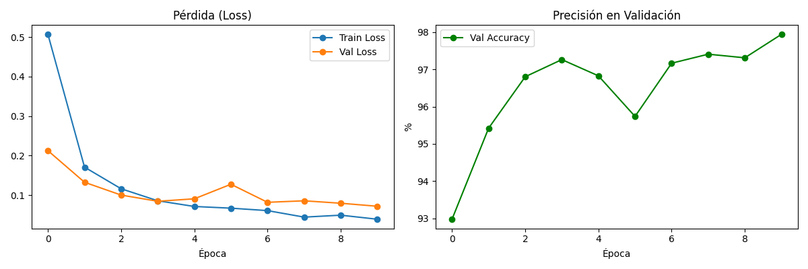
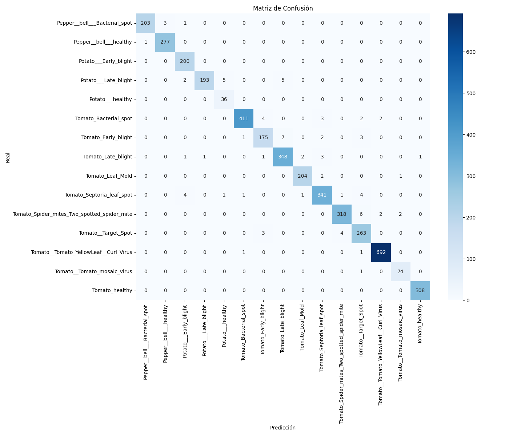
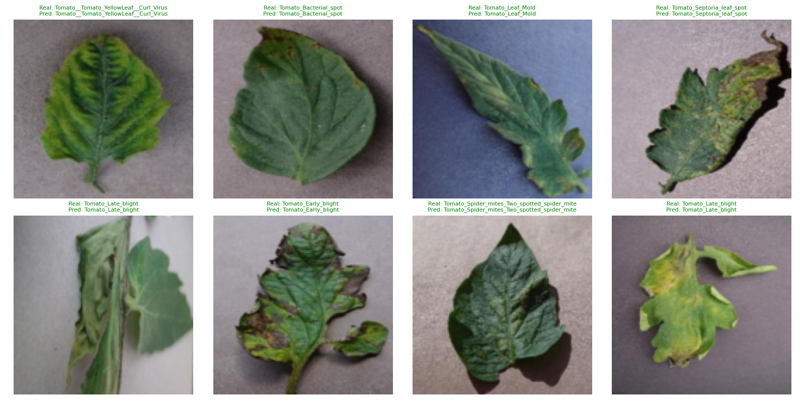

# Clasificación de Enfermedades en Plantas con Deep Learning

Proyecto de clasificación de imágenes usando **PyTorch** y **Transfer Learning** (ResNet18), 
para identificar enfermedades en hojas de cultivos de tomate, papa y pimiento.

## Resultados

- **Precisión en validación: 88.44%**
- Dataset: [PlantVillage](https://www.kaggle.com/datasets/emmarex/plantdisease) (20,638 imágenes, 15 clases)
- Arquitectura: ResNet18 preentrenado (ImageNet) + capa final adaptada
- 5 épocas de entrenamiento, ~48s por época (GPU T4)

## Matriz de Confusión

## Predicciones de ejemplo

## Dataset

15 clases de hojas (tomate, papa, pimiento), sanas y con distintas enfermedades:
- Bacterial spot, Early/Late blight, Leaf Mold, Septoria leaf spot, Spider mites, Target Spot, Yellow Leaf Curl Virus, Mosaic virus

## Tecnologías

- Python, PyTorch, torchvision
- Transfer Learning con ResNet18
- Google Colab (GPU T4)
- scikit-learn, matplotlib, seaborn

## Modelo entrenado

El modelo entrenado (`.pth`) está disponible en Hugging Face: *(próximamente)*

## Conclusiones

- Las clases con patrones visuales distintivos obtuvieron F1 > 0.94 (Pepper Bacterial Spot, Tomato Yellow Leaf Curl Virus).
- La principal dificultad fue distinguir Early Blight de Late Blight, enfermedades visualmente similares.
- Aplicación práctica: un sistema así podría integrarse en una app móvil para que agricultores 
  detecten enfermedades temprano con solo una foto.

## Autor

**Joel Velasquez** — Estudiante de Ingeniería en TI, UTMACH  
[LinkedIn](https://linkedin.com/in/joel-velasquez-827923278) | [GitHub](https://github.com/JoelVelasqueZz)
