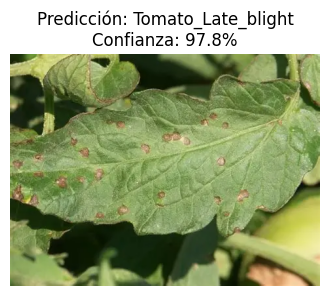
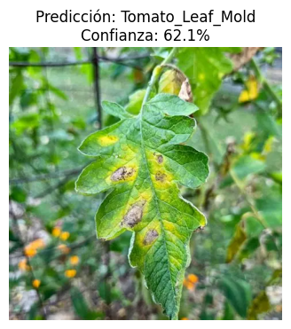
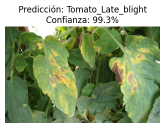

# Clasificación de Enfermedades en Plantas con Deep Learning

Proyecto de clasificación de imágenes usando **PyTorch** y **Transfer Learning** (ResNet18), 
para identificar enfermedades en hojas de cultivos de tomate, papa y pimiento.

## Motivación y contexto

Ecuador cuenta con más de 3,000 hectáreas de tomate y producción significativa de pimiento y papa, con concentraciones importantes en provincias como Loja y El Oro. En estas zonas predomina la **agricultura familiar campesina**, donde el MAG registra cerca de 3,900 productores activos que cultivan entre 0.5 y 5 hectáreas, sin acceso inmediato a un agrónomo para diagnosticar enfermedades.

Una enfermedad no detectada a tiempo puede propagarse y arruinar una cosecha completa. Este proyecto busca ser una **herramienta de primer diagnóstico accesible desde el celular**, permitiendo a agricultores de estas zonas identificar enfermedades tempranas y actuar antes de que se propaguen, sin necesidad de conectividad permanente ni expertos disponibles.

## Resultados

- **Precisión en validación: 97.94% (con class weights para balanceo de clases)**
- Dataset: [PlantVillage](https://www.kaggle.com/datasets/emmarex/plantdisease) (20,638 imágenes, 15 clases)
- Arquitectura: ResNet18 preentrenado (ImageNet), fine-tuning de `layer4` + capa final
- Data augmentation: rotación, flip horizontal, brillo/contraste
- Class weights para compensar desbalance entre clases
- 10 épocas de entrenamiento, ~62s por época (GPU T4)

## Demo interactiva

Prouebe el modelo en vivo (suba una foto o use la cámara):
[plant-disease-demo](https://huggingface.co/spaces/JoelVela/plant-disease-demo)

## Matriz de Confusión

## Predicciones de ejemplo

## Dataset

15 clases de hojas (tomate, papa, pimiento), sanas y con distintas enfermedades:
- Bacterial spot, Early/Late blight, Leaf Mold, Septoria leaf spot, Spider mites, Target Spot, Yellow Leaf Curl Virus, Mosaic virus

**Nota sobre desbalance de clases:** el dataset presenta desbalance entre clases (ej. Tomato YellowLeaf Curl Virus tiene ~8x más imágenes que Tomato Mosaic Virus). Se compensó mediante class weights inversamente proporcionales al tamaño de cada clase, mejorando significativamente el F1-score de clases minoritarias (ej. Tomato_Early_blight: de 0.66 a 0.94).

## Tecnologías

- Python, PyTorch, torchvision
- Transfer Learning con ResNet18 (fine-tuning de layer4)
- Data Augmentation (rotación, flip, brillo/contraste)
- Class Weights para balanceo de clases
- Google Colab (GPU T4)
- scikit-learn, matplotlib, seaborn

## Modelo entrenado

El modelo entrenado (`.pth`) está disponible en Hugging Face: 
[JoelVela/plant-disease-resnet18](https://huggingface.co/JoelVela/plant-disease-resnet18)

## Limitaciones y prueba con imágenes externas

El dataset PlantVillage contiene imágenes con fondo uniforme y condiciones 
controladas. Para evaluar generalización real, se probó el modelo con 
3 imágenes externas (fondos de jardín/campo real, no presentes en el dataset):

**Observaciones:**
- En el caso visualmente más claro (Prueba 3, manchas grandes irregulares, 
  patrón clásico de Late Blight), el modelo predijo correctamente con 99.3% 
  de confianza.
- En casos más ambiguos o con fondos complejos, la confianza bajó 
  notablemente (Prueba 2: 62.1%), y la Prueba 1 (97.8%) podría corresponder 
  a una confusión con Septoria leaf spot, enfermedad visualmente similar.

**Conclusión:** el alto accuracy en validación refleja el desempeño bajo 
condiciones similares al dataset de entrenamiento. La confianza del modelo 
varía según la claridad del patrón y la similitud con las condiciones de 
PlantVillage, lo cual es un punto de mejora para trabajo futuro 
(ej. incluir imágenes de campo real como PlantDoc).

## Evolución del modelo

| Experimento | Val Accuracy | Macro F1 |
|---|---|---|
| Transfer Learning básico (sin augmentation) | 88.44% | 0.88 |
| Fine-tuning + augmentation | 97.84% - 98.33% | 0.97 |
| Fine-tuning + augmentation + class weights | **97.94%** | **0.97** |

La mejora más significativa con class weights no está en el accuracy general 
sino en las clases minoritarias:

| Clase | F1 sin class weights | F1 con class weights |
|---|---|---|
| Tomato_Early_blight | 0.66 | **0.94** |
| Tomato__Target_Spot | 0.80 | **0.96** |
| Tomato__Tomato_mosaic_virus | 0.89 | **0.97** |
| Potato___healthy | 0.91 | **0.92** |

## Conclusiones

- El modelo alcanzó **97.94% de precisión** combinando fine-tuning de 
  `layer4`, data augmentation y class weights para compensar el desbalance 
  de clases.
- La mejora más importante con class weights fue en **Tomato_Early_blight** 
  (F1: 0.66 → 0.94), que era la clase más problemática por su similitud 
  visual con Late_blight y Septoria.
- Las pruebas con imágenes externas revelaron buen desempeño en casos 
  visualmente claros, pero menor confianza en casos ambiguos o con 
  fondos complejos.
- Posibles mejoras futuras: incluir imágenes de campo real (dataset 
  PlantDoc), probar ResNet50, y empaquetar el modelo para uso móvil 
  offline (TorchScript / ONNX).

### Aplicación práctica

Este tipo de modelo podría integrarse en una aplicación móvil que permita
a pequeños agricultores de zonas como Loja y El Oro (Ecuador) tomar una foto 
de una hoja y recibir un diagnóstico preliminar, facilitando la detección 
temprana de enfermedades en cultivos de tomate, papa y pimiento.
Para uso en campo real sería necesario entrenar con imágenes en condiciones 
similares a las del usuario final, y considerar inferencia offline para zonas 
con conectividad limitada.

## Autor

**Joel Velasquez** — Estudiante de Ingeniería en TI, UTMACH  
[LinkedIn](https://linkedin.com/in/joel-velasquez-827923278) | [GitHub](https://github.com/JoelVelasqueZz)
